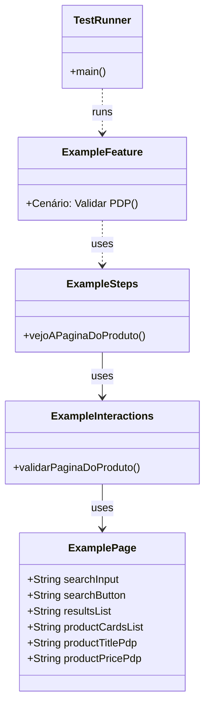
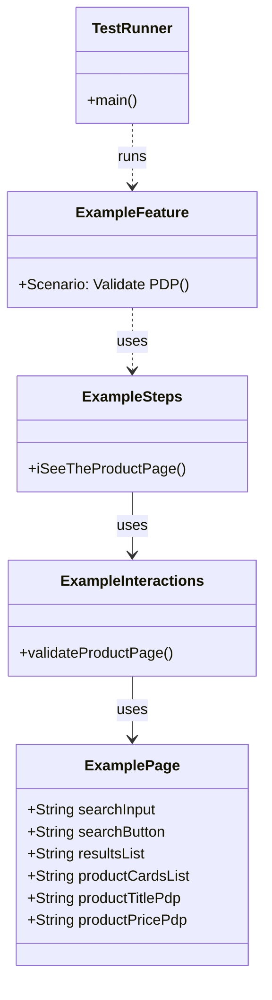

# English documentation is [here](#test-automation-project-documentation-with-playwright-and-cucumber). 

# Documentação do Projeto de Automação de Testes com Playwright e Cucumber

## 1. Visão Geral

Este projeto é uma estrutura de automação de testes utilizando Playwright com Java e Cucumber. Ele é projetado para realizar testes de interface do usuário em aplicações web, seguindo os princípios do Behavior-Driven Development (BDD).

## 2. Arquitetura

O projeto segue uma arquitetura em camadas, típica de projetos de automação de testes:

1. **Camada de Especificação (Gherkin)**: Contém os arquivos .feature com os cenários de teste escritos em linguagem Gherkin.
2. **Camada de Steps**: Implementa os passos definidos nos arquivos .feature.
3. **Camada de Interações**: Contém a lógica de interação com a página web.
4. **Camada de Pages**: Define os elementos da página e seus localizadores.
5. **Camada de Configuração**: Gerencia as configurações do projeto e do ambiente de teste.

## 3. Estrutura de Pastas

```
├── src/
│   ├── main/
│   │   └── java/
│   │       └── br/
│   │           └── com/
│   │               └── playwright/
│   │                   ├── config/
│   │                   └── utils/
│   │
│   └── test/
│       ├── java/
│       │   └── br/
│       │       └── com/
│       │           └── playwright/
│       │               ├── features/
│       │               ├── pages/
│       │               ├── steps/
│       │               └── interactions/
│       │
│       └── resources/
│           └── testconfigs.properties
│
├── pom.xml
├── README.md
├── mvnw
└── mvnw.cmd
```

## 4. Descrição dos Componentes Principais

### 4.1 Camada de Especificação (features/)

Contém os arquivos .feature escritos em Gherkin. Exemplo:

**File: src\test\java\br\com\playwright\features\ExampleFeature.feature**
```gherkin
#language: pt
Funcionalidade: Example Funcionalidade
  // redacted
Cenário: Validar PDP
  Quando pesquiso por "Quadro Decorativo para Camiseta de Futebol"
  Então vejo a lista de resultados
  Quando clico no resultado com texto "Quadro Decorativo para Camiseta de Futebol, Esportes Preto"
  Então vejo a página do produto
```

### 4.2 Camada de Steps (steps/)

Implementa os passos definidos nos arquivos .feature. Exemplo:

**File: src\test\java\br\com\playwright\steps\ExampleSteps.java**
```java
@Então("vejo a página do produto")
public void vejoAPaginaDoProduto() {
    exampleInteractions.validarPaginaDoProduto();
}
```

### 4.3 Camada de Pages (pages/)

Define os elementos da página e seus localizadores. Exemplo:

**File: C:/Users/kesle/AquaProjects/rennerJavaPlaywrightPoc/src/test/java/br/com/playwright/pages/ExamplePage.java**
```java
package br.com.playwright.pages;

public class ExamplePage {
    public String searchInput = "#automation-search-icon-template-input-id";
    public String searchButton = "#automation-search-icon-template-input-id";
    public String resultsList = "#js-productCardContainer";
    public String productCardsList = "product-card-square-listing";
    public String productTitlePdp = "div.desktop-layout div.product-name h1";
    public String productPricePdp = "div.desktop-layout text-label.price div.label";
}
```

## 5. Diagrama de Classes Conceitual



## 6. Conclusão

Esta estrutura de projeto permite uma separação clara de responsabilidades, facilitando a manutenção e expansão dos testes. A combinação de Playwright com Cucumber permite a criação de testes robustos e legíveis, enquanto a organização em camadas promove a reutilização de código e a clareza na implementação dos testes.


Certainly! I'll recreate the documentation in English, detailing the architecture, folder structure, and including a conceptual class diagram.

# Test Automation Project Documentation with Playwright and Cucumber

## 1. Overview

This project is a test automation framework using Playwright with Java and Cucumber. It is designed to perform user interface tests on web applications, following the principles of Behavior-Driven Development (BDD).

## 2. Architecture

The project follows a layered architecture, typical of test automation projects:

1. **Specification Layer (Gherkin)**: Contains .feature files with test scenarios written in Gherkin language.
2. **Steps Layer**: Implements the steps defined in the .feature files.
3. **Interactions Layer**: Contains the logic for interacting with the web page.
4. **Pages Layer**: Defines the page elements and their locators.
5. **Configuration Layer**: Manages project and test environment configurations.

## 3. Folder Structure

```
├── src/
│   ├── main/
│   │   └── java/
│   │       └── br/
│   │           └── com/
│   │               └── playwright/
│   │                   ├── config/
│   │                   └── utils/
│   │
│   └── test/
│       ├── java/
│       │   └── br/
│       │       └── com/
│       │           └── playwright/
│       │               ├── features/
│       │               ├── pages/
│       │               ├── steps/
│       │               └── interactions/
│       │
│       └── resources/
│           └── testconfigs.properties
│
├── pom.xml
├── README.md
├── mvnw
└── mvnw.cmd
```

## 4. Description of Main Components

### 4.1 Specification Layer (features/)

Contains .feature files written in Gherkin. Example:

**File: src\test\java\br\com\playwright\features\ExampleFeature.feature**
```gherkin
#language: pt
Feature: Example Feature
  // redacted
Scenario: Validate PDP
  When I search for "Decorative Frame for Football T-shirt"
  Then I see the list of results
  When I click on the result with text "Decorative Frame for Football T-shirt, Black Sports"
  Then I see the product page
```

### 4.2 Steps Layer (steps/)

Implements the steps defined in the .feature files. Example:

**File: src\test\java\br\com\playwright\steps\ExampleSteps.java**
```java
@Then("I see the product page")
public void iSeeTheProductPage() {
    exampleInteractions.validateProductPage();
}
```

### 4.3 Pages Layer (pages/)

Defines the page elements and their locators. Example:

**File: C:/Users/kesle/AquaProjects/rennerJavaPlaywrightPoc/src/test/java/br/com/playwright/pages/ExamplePage.java**
```java
package br.com.playwright.pages;

public class ExamplePage {
    public String searchInput = "#automation-search-icon-template-input-id";
    public String searchButton = "#automation-search-icon-template-input-id";
    public String resultsList = "#js-productCardContainer";
    public String productCardsList = "product-card-square-listing";
    public String productTitlePdp = "div.desktop-layout div.product-name h1";
    public String productPricePdp = "div.desktop-layout text-label.price div.label";
}
```

## 5. Conceptual Class Diagram



## 6. Conclusion

This project structure allows for a clear separation of responsibilities, facilitating the maintenance and expansion of tests. The combination of Playwright with Cucumber enables the creation of robust and readable tests, while the layered organization promotes code reuse and clarity in test implementation.

The framework is designed to be scalable and maintainable, with each layer having a specific responsibility:

- The Gherkin features provide a high-level, business-readable description of the tests.
- The Steps layer translates these descriptions into executable code.
- The Interactions layer contains the logic for interacting with web elements.
- The Pages layer defines the structure and elements of each web page being tested.

This separation allows for easy updates when the application under test changes, as well as the ability to reuse components across different test scenarios. The use of Playwright provides powerful browser automation capabilities, while Cucumber enables a BDD approach that can improve communication between technical and non-technical team members.